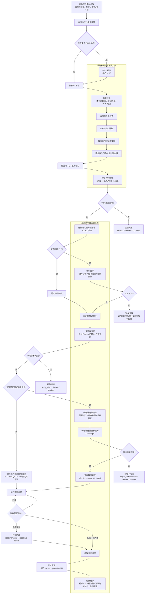
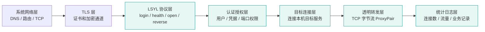
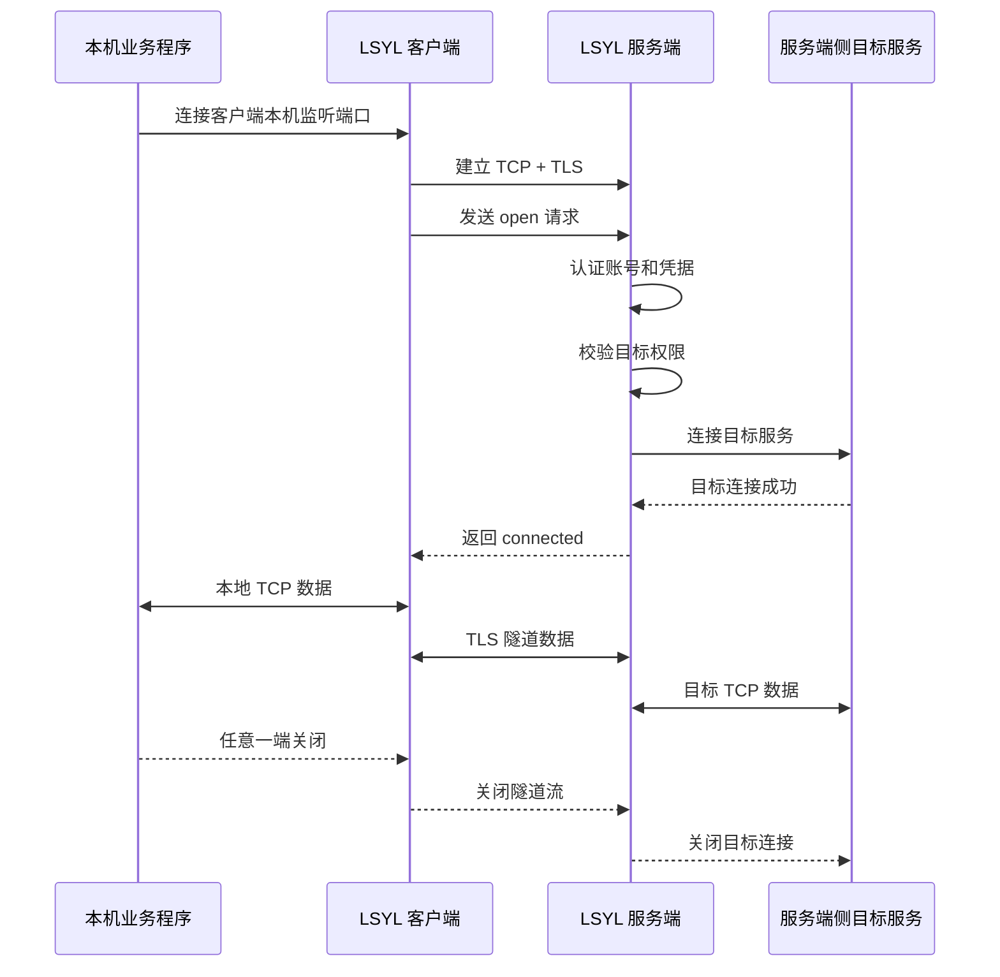
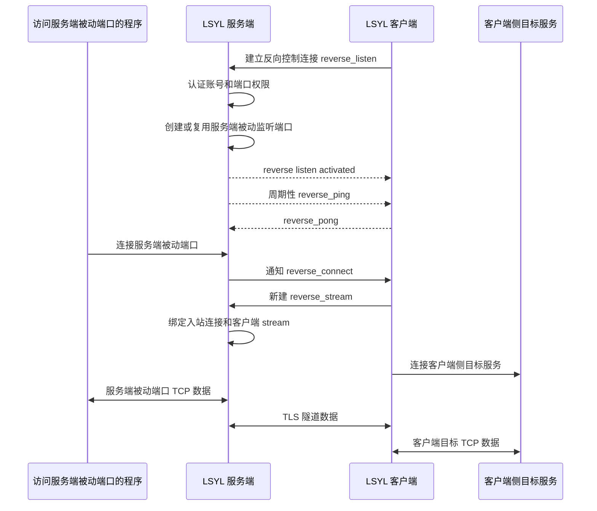

# 网络连接流程与项目所在层级

本文说明一条通用网络连接从发起到关闭的生命周期，并标出 LSYL Tunnel 实际运行在哪些阶段。它用于帮助部署人员、管理员和安全审查人员理解本项目的网络边界。

## 1. 总体定位

LSYL Tunnel 不是虚拟网卡 VPN，也不接管系统路由表。

它是一个运行在应用层的 TLS 隧道和 TCP 端口代理：

- 不转发任意 IP 包。
- 不创建虚拟网卡。
- 不改变系统默认路由。
- 只代理配置好的 TCP 端口。
- 客户端和服务端之间使用 TLS 保护账号、凭据和业务字节流。
- 项目只在连接进入应用进程之后才能认证、授权、转发和统计。

## 2. 通用网络连接生命周期

## 3. LSYL Tunnel 所在位置

本项目主要运行在以下阶段：

- TLS 连接建立后，读取 LSYL 协议请求。
- 校验账号密码或客户端本地密封凭据。
- 按服务端配置和用户授权判断是否允许访问目标。
- 对目标服务发起 TCP 连接。
- 在客户端、服务端和目标服务之间透明复制 TCP 字节流。
- 在连接关闭时记录耗时、流量、连接结果和错误原因。

## 4. 正向代理连接位置

正向代理是 `client_to_server`，典型用途是用户通过客户端本机端口访问服务端侧服务。

正向代理不在业务流中插入应用层心跳。业务数据进入转发阶段后，项目只做透明字节流转发。

客户端为了展示服务端可用性，会额外发起独立的 `health` 短连接探测。`health` 不打开目标端口，不计入业务连接流，也不写业务日志。

## 5. 反向代理连接位置

反向代理是 `server_to_client`，典型用途是服务端创建本机被动入口，由客户端主动连接服务端并激活该入口。

反向代理的控制通道有应用层心跳，用于检测客户端异常离线并释放激活状态。这个心跳只存在于反向控制通道，不进入正向代理业务数据流。

## 6. 项目可统计和不可统计的边界

| 阶段 | 是否由项目直接统计 | 说明 |
|---|---|---|
| DNS 解析 | 否 | 失败只能从客户端连接错误中间接看到。 |
| 路由、防火墙、NAT | 否 | 主要由系统、网络设备、云安全组或防火墙负责。 |
| TCP 半连接、SYN backlog | 否 | 未进入应用进程的连接通常不会出现在项目日志中。 |
| TCP Accept 成功后的连接 | 部分 | 服务端能看到已进入进程的连接，但未必已经完成 TLS 和协议握手。 |
| TLS 握手 | 部分 | 客户端能看到证书、版本、信任链错误；服务端能看到部分握手失败。 |
| LSYL 协议请求 | 是 | `login`、`health`、`open`、`reverse_listen`、`reverse_stream` 会进入请求日志。 |
| 认证失败和封禁 | 是 | 认证失败、封禁和解封状态由服务端维护。 |
| 授权拒绝 | 是 | 用户无权访问目标时记录策略拒绝。 |
| 目标连接失败 | 是 | 目标不可达、连接拒绝、超时会被记录。 |
| 数据转发连接 | 是 | 成功进入转发后统计活跃连接、累计连接、耗时和上下行流量。 |
| 业务协议内部行为 | 否 | 项目不解析 RDP、SQL、HTTP 等业务协议内容。 |

## 7. 统计口径

`login`：

- 用于用户登录和凭据发放。
- 成功会计入服务端认证成功。
- 成功会写业务日志。
- 不计入业务数据流连接数。

`health`：

- 用于客户端后台探测服务端是否可达、凭据是否仍有效。
- 会进入请求日志。
- 不写业务日志。
- 不计入服务端认证成功统计。
- 不计入业务数据流连接数。

`open`：

- 用于正向代理。
- 成功进入数据转发后，计入活跃连接和累计连接。
- 关闭时记录耗时、上下行流量和关闭事件。
- 授权失败或目标不可达不会计入业务数据流连接数。

`reverse_listen`：

- 用于反向代理控制通道。
- 负责激活服务端被动入口。
- 控制通道本身不计入业务数据流连接数。
- 激活、失败、关闭会写业务日志。

`reverse_stream`：

- 用于反向代理数据流。
- 成功绑定入站连接并进入数据转发后，计入活跃连接和累计连接。
- 关闭时记录耗时、上下行流量和关闭事件。

## 8. 对外说明建议

如果需要向运维、安全软件厂商或现场管理员解释网络行为，可以使用下面这段描述：

> LSYL Tunnel 是账号认证的 TLS 加密 TCP 端口代理。服务端监听配置的隧道入口，客户端主动连接服务端。项目不创建虚拟网卡，不修改系统路由，不转发任意 IP 包，只代理管理员配置的 TCP 端口。TLS 用于保护账号凭据和业务字节流；服务端根据用户授权决定是否连接目标服务；连接建立后项目透明复制 TCP 数据，并记录连接元信息、结果、耗时和流量。
