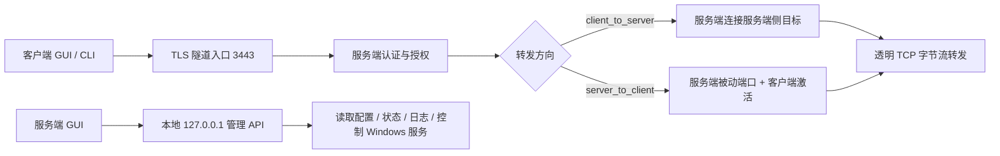
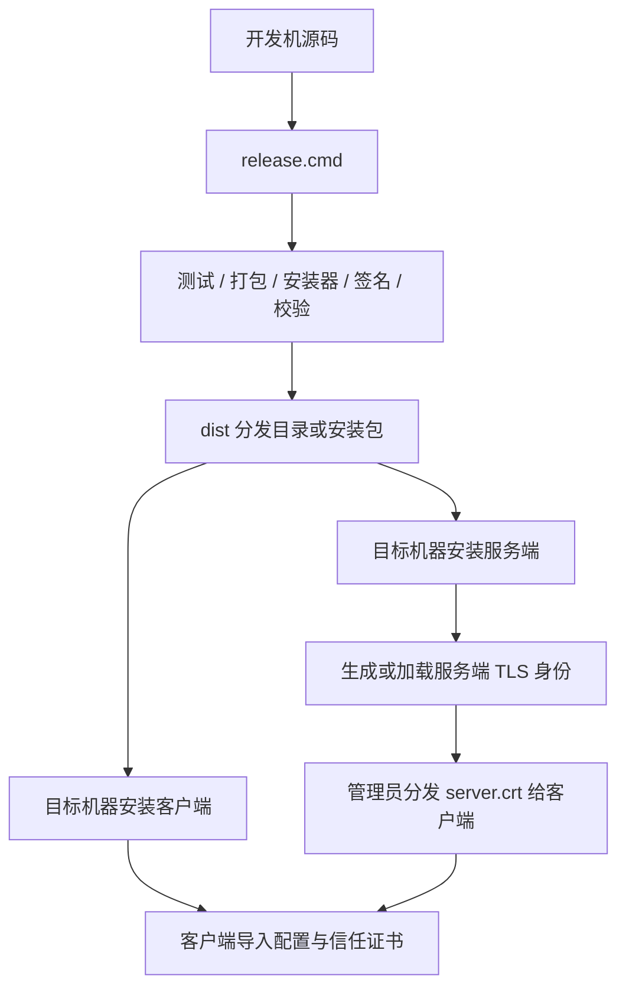
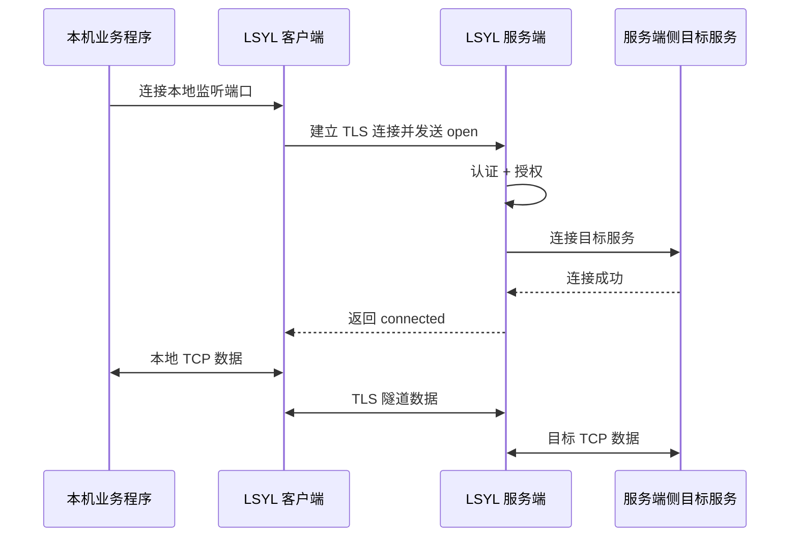
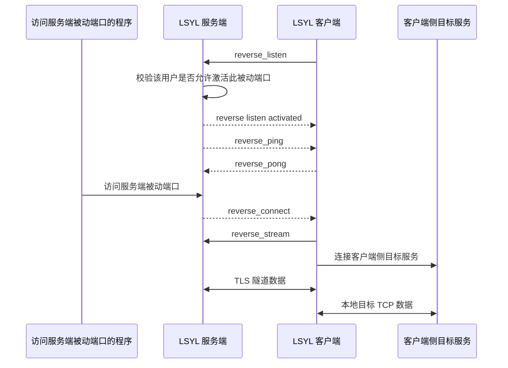

# 系统总流程与运行边界

本文用于把 LSYL Tunnel 的整体流程讲清楚，重点回答四个问题：

1. 这套系统到底是什么，不是什么。
2. 客户端、服务端、GUI、Windows 服务分别是谁。
3. 配置、启动、连接、转发各自怎么流转。
4. 哪些地方是正常容易混的概念边界。

更细的网络分层说明见 [网络连接流程与项目所在层级](network-flow-zh.md)，安装与签名见 [Windows 部署与安装](../deployment/windows-deployment-zh.md) 和 [签名发布指南](../release/signing-zh.md)。

## 1. 一句话定义

LSYL Tunnel 是一个运行在应用层的“安全隧道 / 应用代理”系统：

- 身份边界是用户名和密码，不是客户端证书。
- 传输保护由 TLS 提供。
- 访问边界由服务端配置的转发规则和用户授权决定。
- 它不创建虚拟网卡，不接管系统路由，不是系统级 VPN。
- 它只代理管理员明确配置的 TCP 端口。

## 2. 先认清 5 个入口

很多理解成本，不在协议本身，而在“谁是管理台、谁是真正服务、谁只是调试入口”。

| 入口 | 作用 | 典型场景 |
|---|---|---|
| `lsyl-tunnel-client-gui.exe` | Windows 客户端主程序，内置 GUI 和隧道引擎 | 普通用户连接 |
| `lsyl-tunnel-client-lite.exe` | Win7 轻量客户端，导入 `.lsylprofile` 后连接/断开 | 老系统或不需要托盘值守的用户 |
| `lsyl-tunnel-client.exe` | 客户端 CLI | 调试、脚本化运行 |
| `lsyl-tunnel-server-gui.exe` | 服务端本地管理台，内嵌 Web 运维界面 | 管理员查看状态、改配置、重启服务 |
| `lsyl-tunnel-server-svc.exe` | Windows 服务实际运行体 | 正式服务端驻留运行 |
| `lsyl-tunnel-server.exe` | 服务端 CLI | 本机调试、前台运行 |

可以把它们记成下面这句话：

> 客户端 GUI 自己就带隧道引擎；服务端 GUI 只是管理台，真正跑流量的是服务端程序或 Windows 服务。

## 3. 系统总图

## 4. 安装与部署流程

交付视角下，建议把流程理解为两段：`开发机出包` 和 `目标机安装运行`。

部署时最重要的边界是：

- 服务端私钥只留在服务端。
- 客户端只信任服务端公开证书 `server.crt`。
- 客户端安装包默认不注册 Windows 服务。
- 服务端正式驻留运行通常走 Windows 服务。

## 5. 服务端运行流程

服务端真正处理业务流量时，流程是线性的：

1. 读取 `server.yaml`。
2. 加载服务端 TLS 证书和私钥。
3. 加载用户、转发规则、凭据密封密钥、运行态文件。
4. 监听隧道入口端口，默认 `0.0.0.0:3443`。
5. 如配置了 `monitor_addr`，同时打开本地监控接口。
6. 等待客户端接入。
7. 接入后先读 TLS 内部的 LSYL 请求。
8. 校验账号密码或保存凭据。
9. 按转发规则判断用户是否有权访问目标端口。
10. 允许后建立目标连接并进入透明转发。

可以把它理解成：

> 服务端先决定“你是谁、你能去哪”，只有都通过了，才真正开始搬运字节流。

## 6. 客户端连接流程

客户端 GUI 的核心逻辑，不是“点按钮就常驻后台服务”，而是“GUI 进程内拉起隧道引擎并托盘值守”。

流程如下：

1. 客户端启动，读取 `client.yaml`。
2. 读取客户端信任的服务端证书 `server.crt`。
3. 用户点击“连接”。
4. 先做一次短连接登录检查。
5. 如果本次输入了明文密码，且服务端返回可用的凭据密封公钥：
   - 客户端把密码换成服务端可识别的短期密封凭据。
   - 本地配置保存密封凭据，不再保存明文密码。
6. 客户端在当前 GUI 进程内启动隧道引擎。
7. 对每条正向端口建立本地监听；对每条反向端口建立反向控制连接。
8. 用户关闭窗口时隐藏到托盘，不中断连接。
9. 用户退出客户端时，才真正停止隧道。

这里最容易混的点是：

- “保存配置”不等于“已经连上”。
- “关闭窗口”不等于“退出客户端”。
- “客户端已安装”不等于“客户端作为系统服务常驻运行”。

## 7. 正向代理流程

正向代理是 `client_to_server`，意思是：

- 客户端在本机监听一个端口。
- 本机业务程序连这个端口。
- 服务端再去连接服务端侧目标。

这条链路里，客户端本地业务程序并不知道远端协议细节；项目在建立成功后只做透明 TCP 转发。

## 8. 反向代理流程

反向代理是 `server_to_client`，意思是：

- 服务端先开一个被动监听端口。
- 客户端主动连服务端，激活这个被动端口。
- 有人访问服务端被动端口时，服务端再通知客户端回建一条数据流。
- 客户端去连接自己本机侧目标服务。

这条链路的关键点是：

- 服务端不会主动拨进客户端网络。
- 客户端始终是主动连接服务端的一侧。
- 反向控制连接有应用层心跳，目的是及时发现客户端离线。

## 9. 配置流转与生效边界

这部分是运维最容易误解的地方。

### 9.1 服务端

- GUI 读取的是当前配置文件和当前运行状态。
- 在 GUI 中点击保存，本质上是改写 `server.yaml`。
- 改写配置后，通常需要重启服务才会按新配置运行。
- 运行中已有连接是否立刻变化，取决于具体改动位置；不要把“保存配置”理解成“所有行为实时切换”。

### 9.2 客户端

- GUI 中点击连接时，会先把当前输入整理成本地运行配置。
- 如果登录成功并生成密封凭据，本地配置会被更新。
- 真正开始监听端口和处理流量，发生在隧道引擎启动之后。
- 断开连接后，配置仍在；只是运行态停止。

## 10. 凭据边界

项目里常见的 4 类“证书/凭据”很容易混，建议固定这样理解：

| 名称 | 放在哪 | 用途 |
|---|---|---|
| 服务端 TLS 证书 `server.crt` | 服务端生成，客户端信任 | 证明“你连到的是正确服务端” |
| 服务端 TLS 私钥 `server.key` | 只在服务端 | TLS 身份私钥，不可外发 |
| 用户名 / 密码 | 服务端配置，客户端登录时使用 | 证明“你是谁” |
| 保存凭据 `saved_credential` | 客户端本地配置 | 代替明文密码做后续快速连接 |
| `credential_seal` 密钥 | 服务端 | 用于签发和验证客户端保存凭据 |

一句话记忆：

> TLS 证书解决“我连的是谁”，账号密码或保存凭据解决“我是谁”。

## 11. 监控、日志与统计边界

项目能直接看到的是“进入应用后的连接”，看不到的是“还没进入应用前的系统网络细节”。

项目擅长记录：

- 登录、健康检查、打开流、反向激活
- 授权拒绝
- 目标连接失败
- 连接关闭、耗时、上下行流量
- 被封禁和解封状态

项目不直接掌握：

- DNS 解析细节
- 路由/NAT/云安全组内部决策
- 未进入进程前的半连接攻击细节
- 被代理业务协议内部的应用语义

## 12. 推荐心智模型

如果后续要向实施人员、管理员、开发人员反复解释这套系统，最稳的一句话是：

> LSYL Tunnel 不是系统级 VPN，而是账号认证的 TLS 加密 TCP 应用代理。客户端主动连服务端，服务端按用户授权决定是否允许访问某个目标端口；连接建立后只做透明字节流转发。

再缩成 4 个短句，就是：

1. 不是 VPN，是应用代理。
2. 客户端 GUI 自带引擎，服务端 GUI 只是管理台。
3. 先认证授权，再转发流量。
4. 服务端不主动打进客户端网络。
